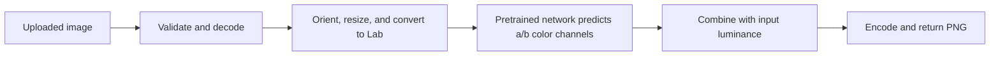

<div align="center">

# chroma. · Backend

### The color behind the memories.

A FastAPI image-colorization service powered by a pretrained model running directly on the server.


[**Try the live project ↗**](https://colorization-of-black-and-white-fro.vercel.app/) · [Frontend repository](https://github.com/AryanSehgal/colorization-of-black-and-white-frontend) · [API docs](https://colorization-of-black-and-white-backend.onrender.com/docs) · [Health endpoint](https://colorization-of-black-and-white-backend.onrender.com/api/health)

Built by **[Aryan Sehgal](https://github.com/AryanSehgal)**

</div>

---

## From grayscale to color

Chroma uses the pretrained **Colorful Image Colorization** model by Richard Zhang, Phillip Isola, and Alexei A. Efros (ECCV 2016). OpenCV runs the Caffe network on the CPU, predicts color information, and returns a downloadable PNG.

**No third-party AI inference API is called.** Model assets are downloaded during setup; image processing then runs locally within the backend service.


*The companion React studio consuming this API. Explore the [frontend repository](https://github.com/AryanSehgal/colorization-of-black-and-white-frontend) for the complete interface.*

## What this service provides

- Multipart JPEG, PNG, and WebP uploads with file-size and pixel-count validation.
- Pretrained CPU inference with adjustable color intensity.
- EXIF orientation handling, transparency compositing, and bounded output dimensions.
- PNG responses with dimensions and processing-time headers.
- A model-readiness endpoint and generated OpenAPI documentation.
- Serialized inference to protect the stateful OpenCV network; overlapping jobs receive `429`.
- Configurable CORS for a separately hosted frontend.
- Memory-conscious settings: one OpenCV thread, Winograd disabled, and configurable model input resolution.

## How colorization works



The model predicts the `a` and `b` chroma channels in CIE Lab space. The input supplies luminance, and an intensity multiplier controls the strength of the predicted color before conversion back to RGB.

Predicted colors are plausible interpretations, not guaranteed reconstructions of historical colors. Smaller model input sizes reduce memory use but can reduce color detail.

## Run locally

Use **Python 3.12**. Downloading the model requires internet access; inference does not require an external AI service.

```bash
git clone https://github.com/AryanSehgal/colorization-of-black-and-white-backend.git
cd colorization-of-black-and-white-backend
python3.12 -m venv .venv
source .venv/bin/activate
python -m pip install --only-binary=:all: -r requirements.txt
python scripts/download_model.py
uvicorn app.main:app --host 127.0.0.1 --port 8000 --workers 1
```

On Windows, create the environment with `py -3.12 -m venv .venv` and activate it with `.venv\Scripts\Activate.ps1` in PowerShell.

- **Health:** http://127.0.0.1:8000/api/health
- **Interactive API docs:** http://127.0.0.1:8000/docs
- **Companion frontend:** [setup instructions](https://github.com/AryanSehgal/colorization-of-black-and-white-frontend#run-locally)

### Model assets

The download script populates `models/` with the Caffe weights, network definition, color-cluster array, and model license. It validates downloaded assets and reuses valid existing files.

**Do not commit the `.caffemodel` file.** Model assets are excluded by `.gitignore`; run the downloader locally or during the hosting build instead.

## Configuration

Set these as process environment variables or through your hosting dashboard. `.env.example` is a reference; the application does **not** automatically load `.env` files.

| Variable | Default | Purpose |
| --- | --- | --- |
| `ALLOWED_ORIGINS` | `http://localhost:5173,http://127.0.0.1:5173` | Comma-separated frontend origins |
| `MAX_IMAGE_PIXELS` | `24000000` | Maximum uploaded image pixel count |
| `MAX_IMAGE_EDGE` | `2400` | Longest output edge, preserving aspect ratio |
| `MODEL_INPUT_SIZE` | `224` | Network input edge: `128`, `160`, `192`, or `224` |
| `OMP_NUM_THREADS` | Runtime default | OpenMP thread limit |
| `OPENBLAS_NUM_THREADS` | Runtime default | OpenBLAS thread limit |

The upload-size limit is **12 MB per photo**. Color intensity accepts values from **0 to 1.5**, with **1.0** as the default.

### Conservative settings for a small instance

```dotenv
ALLOWED_ORIGINS=https://colorization-of-black-and-white-fro.vercel.app
MAX_IMAGE_PIXELS=2000000
MAX_IMAGE_EDGE=768
MODEL_INPUT_SIZE=160
OMP_NUM_THREADS=1
OPENBLAS_NUM_THREADS=1
```

These settings reduce resource use; they do not guarantee that every workload fits a free hosting instance. Use **one Uvicorn worker** to avoid loading additional model copies.

## API quick reference

### `GET /api/health`

Returns model readiness, model name, a diagnostic message, and configured upload/output limits. Check `ready`, not only the HTTP status: the endpoint can respond while the model is unavailable. Readiness indicates loaded weights, not a completed inference test.

### `POST /api/colorize`

Send a multipart form with:

| Field | Type | Required | Description |
| --- | --- | --- | --- |
| `file` | Image file | Yes | JPEG, PNG, or WebP |
| `intensity` | Number | No | Color strength from `0` to `1.5`; defaults to `1` |

```bash
curl --fail-with-body \
  'http://127.0.0.1:8000/api/colorize' \
  -F 'file=@photo.jpg' \
  -F 'intensity=1' \
  --output colorized.png
```

Let `curl` set the multipart boundary; do not manually set `Content-Type`. For the hosted API, replace the local origin with `https://colorization-of-black-and-white-backend.onrender.com`.

A successful response contains `image/png`, plus `X-Image-Width`, `X-Image-Height`, `X-Processing-Seconds`, and a download filename in `Content-Disposition`.

| Status | Meaning |
| --- | --- |
| `200` | PNG generated successfully |
| `413` | Upload or request body exceeds the size limit |
| `422` | Invalid image, unsupported input, pixel limit, or invalid intensity |
| `429` | Another inference is already running |
| `500` | Unexpected processing error; inspect backend logs |
| `503` | Model unavailable; verify model assets and restart |

The frontend implements multi-photo batches by calling this single-image endpoint sequentially.

## Deploy on Render

Create a Python web service connected to this repository, with the repository root as the root directory.

**Build command**

```bash
python --version && python -m pip install --only-binary=:all: -r requirements.txt && python scripts/download_model.py
```

**Start command**

```bash
uvicorn app.main:app --host 0.0.0.0 --port $PORT --workers 1
```

Set `PYTHON_VERSION=3.12.13`, configure the environment variables above, and use **`/api/health`** as the health-check path. Keep Python on the tested 3.12 line for the pinned dependencies.

The frontend lives on Vercel. Its `VITE_API_BASE_URL` must point to this service's origin, and this service's `ALLOWED_ORIGINS` must include the exact frontend origin.

See [DEPLOYMENT.md](DEPLOYMENT.md) for the complete split-deployment workflow.

## Tests

```bash
python -m pip install -r requirements-dev.txt
python -m pytest -q
RUN_MODEL_TESTS=1 python -m pytest -q
```

The last command also runs real-model inference and requires downloaded model assets. In PowerShell, set `$env:RUN_MODEL_TESTS="1"` before running pytest.

## Troubleshooting

| Symptom | What to check |
| --- | --- |
| Browser reports CORS failure | `ALLOWED_ORIGINS` must match the frontend origin; save and redeploy |
| Pillow fails to build | Verify Python 3.12 is selected and clear stale build cache |
| Model is unavailable | Run the downloader and inspect its output |
| Health works but colorization returns `502` | Check Render events/logs for restarts or memory exhaustion; verify small-instance settings and one worker |
| `/` returns `404` | Expected: use `/api/health` or `/docs` |
| First request is slow | A free backend may be waking up; retry after it becomes ready |

## Project map

```text
app/main.py             FastAPI routes, CORS, upload limits, inference lock
app/colorizer.py        Image decoding and pretrained-model inference
scripts/download_model.py
                        Model download and asset validation
models/                 Downloaded assets, excluded from source control
tests/                  API validation and optional real-model tests
docs/images/            README screenshot
requirements.txt        Runtime dependencies
```

## Privacy and credits

The application does not maintain a persistent photo library. Uploaded images are processed for the request and the resulting PNG is returned to the client; multipart handling may use temporary storage. Hosting infrastructure still receives requests, and application/server logs may contain request metadata.

Created by **[Aryan Sehgal](https://github.com/AryanSehgal)**. Model research: **[Colorful Image Colorization](https://richzhang.github.io/colorization/)**, Richard Zhang, Phillip Isola, and Alexei A. Efros, ECCV 2016. See the [original model repository](https://github.com/richzhang/colorization/tree/caffe) and [THIRD_PARTY_NOTICES.md](THIRD_PARTY_NOTICES.md) for attribution and upstream license details. Preserve the model license when redistributing its assets. No project-wide license is granted by this README.

---

<div align="center">

**A little color. A new perspective.**

[Live studio](https://colorization-of-black-and-white-fro.vercel.app/) · [Frontend](https://github.com/AryanSehgal/colorization-of-black-and-white-frontend) · [Backend](https://github.com/AryanSehgal/colorization-of-black-and-white-backend)

</div>
